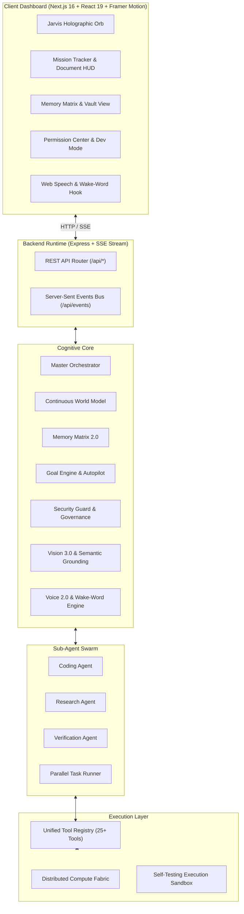

# 🤖 JARVIS 3.0: Autonomous Multi-Agent AI Operating System

<div align="center">


**JARVIS 3.0** is an enterprise-grade, autonomous AI Operating System designed to perceive, reason, orchestrate, and execute complex workflows across your desktop, web, and distributed compute environments.

[Features](#-key-capabilities) •
[Architecture](#-system-architecture) •
[Quick Start](#-quick-start) •
[Tool Registry](#-tool-registry-25-built-in-tools) •
[API Reference](#-api-endpoints-reference) •
[Operating Modes](#-operating-modes--governance) •
[Tests](#-testing--quality-assurance)

</div>

---

## 🌟 Overview

JARVIS 3.0 evolves beyond traditional conversational chatbots into a persistent, autonomous **AI Operating System (AI OS)**. It unites hierarchical multi-agent swarms, a 5-tier dynamic Memory Matrix, continuous World Modeling, computer vision perception, natural voice synthesis with offline wake-word detection, a verifiable document reading engine, and a distributed compute fabric into a cohesive, holographic command dashboard.

Whether writing and debugging code in a sandbox, visually grounding UI elements on screen, orchestrating multi-phase research missions, or dispatching heavy workloads to distributed compute nodes, JARVIS functions with decisive speed, contextual depth, and zero-friction human-in-the-loop safety.

---

## 🧠 Key Capabilities

### 1. Multi-Agent Swarm & Goal Autopilot
- **Master Orchestrator**: Coordinates sub-agents, delegates sub-tasks, and drives the autonomous execution loop.
- **Specialized Sub-Agents**:
  - `Coding Agent`: Synthesizes, verifies, edits, and debugs code across projects.
  - `Research Agent`: Gathers intelligence, browses the web, extracts deep research from multiple sources.
  - `Verification Agent`: Rigorously verifies execution outputs, test results, and UI states.
  - `Parallel Task Runner`: Spawns concurrent asynchronous sub-agents for high-throughput operations.
- **Goal Engine & Mission Tracker**: Deconstructs high-level directives into hierarchical sub-goals with live telemetry, progress monitoring, and instant pause/resume/cancel controls.

### 2. Memory Matrix 2.0
- **5-Layer Memory Architecture**:
  - **Episodic**: History of past missions, events, and tool outcomes.
  - **Working Memory**: Active scratchpad and operational context for active tasks.
  - **Semantic Memory**: Vectorized search across historical knowledge and facts.
  - **Procedural Memory**: Saved workflows, operational recipes, and behavioral guidelines.
  - **Constraint Memory**: Explicit user preferences, restrictions, and safety boundaries.
- **Conflict Detection & Resolution**: Detects contradictory facts and resolves them via customizable strategies (`OVERWRITE`, `MERGE`, `USER_RESOLVE`).
- **Importance Decay & Scoring**: Dynamically scores facts from 1 to 5 to prioritize critical user data.

### 3. World Model & Real-Time SSE Event Bus
- **Continuous State Tracking**: Maintains live awareness of the user's active window, system resources, running processes, available tools, visual perception, and active missions.
- **Server-Sent Events (SSE)**: Streams low-latency state changes, terminal outputs, tool execution logs, and audio events directly to the frontend dashboard.

### 4. Visual Perception & Semantic Grounding (VLM 3.0)
- **Visual Language Model (VLM)**: Deep screen understanding, UI inspection, and automated screenshot analysis.
- **Semantic UI Grounding**: Locates and clicks buttons, input fields, and icons via descriptive queries rather than brittle hardcoded coordinates.
- **OCR Engine**: Extracts text directly from screens, PDFs, and graphical assets.
- **Visual Action Verification**: Captures before-and-after screen states to visually confirm that requested desktop actions succeeded.

### 5. Natural Voice 2.0 & Offline Wake-Word Detection
- **Offline Wake-Word Engine**: Instant, low-latency detection of the wake word **"JARVIS"** without cloud latency.
- **Natural Interruption**: Speaking or triggering the wake word immediately halts agent speech for fluid conversation.
- **Prosody & Pronunciation Engine**: Context-aware speech pacing, natural pauses, and phonetic enhancements.
- **Acoustic Feedback**: Real-time microphone levels and dynamic holographic orb animations.

### 6. Distributed Compute Fabric
- **Dynamic Worker Registry**: Register, monitor, and load-balance across local and remote compute nodes.
- **GPU-Aware Job Scheduler**: Dispatches computational tasks based on priority, GPU requirements, and node availability.
- **Heartbeat & Fault Tolerance**: Automatically detects lost workers and reschedules pending tasks.

### 7. Verifiable Document Reading Engine
- **Sentence-Level Segmentation**: Splits documents into digestible, readable segments.
- **Synchronized Audio-Text Telemetry**: Highlights text word-by-word in real time as the TTS engine plays.
- **Interactive Reading HUD**: Play, pause, resume, skip, restart, or run completion verification.

### 8. Gameverse Hub
- An arcade and simulation suite built into JARVIS with an **AI Game Director**, physics engine, and dynamic procedural mechanics.
- **Featured Games**: `BossProtocol`, `CyberHeist`, `JarvisCommand`, `VoidRunner`, `AIArena`, `Codebreak`, `JarvisTactics`, and `NeuralRush`.
- **Gamer Profile**: Tracks player levels, achievements, and session XP.

---

## 🏛️ System Architecture



---

## 🛠️ Tool Registry (25+ Built-In Tools)

JARVIS features a comprehensive tool registry validated for LangChain and Google Gemini function calling:

| Category | Tool | Description |
| :--- | :--- | :--- |
| **File Ops** | `read_file` | Read content from files within the workspace |
| | `list_directory` | Explore directories and inspect file hierarchies |
| | `manage_files` | Create, edit, rename, and organize workspace files |
| **Terminal & Sandbox** | `run_terminal_command` | Execute shell commands in a governed environment |
| | `execute_code_sandbox` | Run isolated Python/JavaScript snippets safely |
| **Web & Intelligence** | `search_web` | Query live web search engines for fresh information |
| | `open_url` | Launch URLs in default browser sessions |
| | `web_fetch` | Fetch raw HTML/Markdown content from any web page |
| **Version Control** | `get_git_status` | Inspect repo branch, stage, and working tree |
| | `get_git_log` | Review recent commit history and diffs |
| **Memory Matrix** | `save_memory` | Save facts, preferences, and guidelines to long-term memory |
| | `recall_memory` | Retrieve exact facts or query semantic memory |
| **Computer Use & Desktop** | `capture_screen` | Take high-resolution desktop screenshots |
| | `inspect_ui_elements` | Inspect clickable elements and accessibility trees |
| | `mouse_click` | Perform simulated mouse clicks at given coordinates |
| | `type_text` | Simulate real-time keyboard text typing |
| | `keyboard_press` | Trigger special keystrokes (Enter, Escape, Shortcuts) |
| | `wait_for_ui_state` | Poll until specific UI conditions or windows appear |
| | `verify_ui_state` | Confirm visual outcomes after desktop interactions |
| **Visual Ops (VLM 3.0)** | `ground_ui_element` | Resolve semantic text queries to bounding box coordinates |
| | `click_semantic_element` | Click UI elements identified by visual description |
| | `read_screen_text` | Run OCR on the entire display or bounded regions |
| | `visually_verify_action` | Visually confirm that a UI action took effect |
| **Compute Fabric** | `dispatch_distributed_job` | Route heavy compute jobs to available worker nodes |
| | `query_compute_fabric` | Check cluster nodes, utilization, and job queues |
| | `manage_distributed_job` | Cancel, pause, or reschedule cluster compute jobs |
| **Background & Tasks** | `create_background_task` | Launch asynchronous background tasks |
| | `manage_background_task` | Monitor, pause, resume, retry, or cancel tasks |
| **Skills & Vault** | `run_skill` | Execute pre-recorded or saved multi-step workflows |
| | `save_workflow_skill` | Record new custom skills dynamically |
| | `query_knowledge_vault` | Query ingested documentation with vector search |
| | `ingest_vault_document` | Add new knowledge files to the vector repository |
| **Media & System** | `search_media` / `play_media` | Search and stream music/videos via YouTube |
| | `system_volume` / `system_power` | Manage system volume levels and power states |
| | `manage_process` | List, launch, or terminate background processes |
| | `read_active_window` | Detect the currently focused foreground application |
| **Entertainment** | `launch_gameverse_game` | Start games within the built-in Gameverse suite |

---

## 🛡️ Operating Modes & Governance

JARVIS features a 3-tier security governance architecture via the `SecurityGuard`:

| Mode | Autonomy Level | Description |
| :--- | :---: | :--- |
| **`ZERO_FRICTION`** *(Default)* | **Maximum** | Direct, decisive, and ultra-fast. Auto-approves safe and ordinary commands (e.g. read files, search web, query memory, status checks) while gating destructive or irreversible actions. |
| **`AUTONOMOUS`** | **Balanced** | Autonomous multi-step goal execution with confirmation prompts for moderate-risk operations (e.g. file overwrites, process kills). |
| **`ASSISTED`** | **Guided** | Co-pilot mode where every tool execution step requires explicit human approval. |

### Emergency Overrides
At any point during execution, the user can issue an instant override directive:
- **`STOP`** or **`PAUSE`**: Immediately halts all active missions and running tools.
- **`RESUME`** or **`CONTINUE`**: Resumes paused missions from their last verified state.
- **`CANCEL`** or **`ABORT`**: Terminates the active mission cleanly.

---

## 📁 Project Structure

```
Jarvis/
├── client/                           # Next.js 16 Frontend Web Application
│   ├── public/                       # Static SVGs, icons, and assets
│   ├── src/
│   │   ├── app/                      # App router (page.tsx, layout.tsx, globals.css)
│   │   ├── components/               # Holographic UI Components
│   │   │   ├── JarvisOrb.tsx         # Dynamic animated WebGL/CSS energy orb
│   │   │   ├── TerminalLog.tsx       # Real-time console log viewer
│   │   │   ├── MissionTracker.tsx    # Hierarchical goal & mission progress
│   │   │   ├── ToolActivityFeed.tsx  # Live tool execution stream
│   │   │   ├── MemoryMatrixView.tsx  # Memory browser, conflict resolution UI
│   │   │   ├── KnowledgeVaultView.tsx# Document repository & vector search
│   │   │   ├── PermissionCenter.tsx  # Mode switcher & permission governance
│   │   │   ├── SecurityApprovalModal.tsx # Interactive action confirmation modal
│   │   │   ├── DocumentReaderHUD.tsx # Synchronized audio-text document reader
│   │   │   ├── SkillsHub.tsx         # Skill management and execution hub
│   │   │   ├── DeveloperMode.tsx     # SSE metrics, fabric nodes, JSON inspect
│   │   │   └── VoiceSettingsModal.tsx# Voice prosody, volume, mic sensitivity
│   │   ├── gameverse/                # Gameverse engine and mini-games
│   │   │   ├── components/           # Game cards, profile modal, hub
│   │   │   ├── engine/               # GameLoop, Collision, Audio, Director
│   │   │   └── games/                # BossProtocol, VoidRunner, AIArena, etc.
│   │   ├── hooks/                    # useSpeech, useWakeWord custom React hooks
│   │   └── lib/                      # Firebase auth, DocumentReaderController, VoiceEngine
│   ├── .env.example                  # Client environment variable template
│   └── package.json
│
├── server/                           # Express.js + LangChain Cognitive Backend
│   ├── db/                           # Persistent JSON databases (state, memory)
│   ├── src/
│   │   ├── agents/                   # Orchestrator, Coding, Research, Verifier
│   │   ├── benchmark/                # Autonomy benchmarking suite
│   │   ├── collaboration/            # Human + AI decision workflows
│   │   ├── compute/                  # Distributed fabric, scheduler, workers
│   │   ├── computer/                 # Desktop automation & screen capture
│   │   ├── goals/                    # Goal engine & mission autopilot
│   │   ├── llm/                      # Google Gemini model routing & telemetry
│   │   ├── memory/                   # Memory Matrix 2.0 (vector, episodic, facts)
│   │   ├── proactive/                # Proactive suggestion generator
│   │   ├── reading/                  # Document extractor, segmenter, session manager
│   │   ├── routes/                   # REST API routes (api.js, gameverse.js)
│   │   ├── sandbox/                  # Safe script execution sandbox
│   │   ├── security/                 # SecurityGuard, permission store, audit logs
│   │   ├── skills/                   # Reusable workflow skills manager
│   │   ├── tasks/                    # Background task runner & queue
│   │   ├── tools/                    # 25+ tool modules & Gemini validator
│   │   ├── vault/                    # Knowledge Vault document storage
│   │   ├── vision/                   # VLM provider, OCR, visual grounding
│   │   ├── voice/                    # Wake-word engine, prosody, pronunciation
│   │   ├── world/                    # Dynamic World Model state
│   │   └── index.js                  # Server entry point & SSE broadcaster
│   ├── tests/                        # Comprehensive test suite (22 test files)
│   ├── .env.example                  # Server environment variable template
│   └── package.json
│
├── .gitignore                        # Global Git ignore rules (protects .env)
└── README.md                         # Project documentation
```

---

## 🚀 Quick Start

### 1. Prerequisites

- [Node.js](https://nodejs.org/) (version **18.x** or higher recommended)
- [npm](https://www.npmjs.com/) or [yarn](https://yarnpkg.com/)
- A **Google Gemini API Key** (from [Google AI Studio](https://aistudio.google.com/))

### 2. Clone the Repository

```bash
git clone https://github.com/ASstyles/Jarvis.git
cd Jarvis
```

### 3. Backend Setup

```bash
cd server
npm install
```

Configure your environment variables:

```bash
cp .env.example .env
```

Open `server/.env` and insert your Gemini API Key:

```env
PORT=4000
GEMINI_API_KEY="your_actual_gemini_api_key_here"
GEMINI_MODEL=gemini-2.0-flash
```

Start the backend server:

```bash
node src/index.js
```

You should see:
```log
[SYS] JARVIS 2.0 Autonomous AI Operating System online on port 4000
```

### 4. Frontend Setup

In a new terminal window:

```bash
cd client
npm install
```

Configure client environment variables:

```bash
cp .env.example .env.local
```

Verify `client/.env.local`:

```env
NEXT_PUBLIC_SERVER_URL=http://localhost:4000
```

*(Optional: Fill in your Firebase keys in `.env.local` if you want Google OAuth authentication enabled).*

Start the Next.js development server:

```bash
npm run dev
```

Visit **[http://localhost:3000](http://localhost:3000)** in your browser.

---

## 📡 API Endpoints Reference

### Core & Streaming
- `GET /api/events`: Server-Sent Events (SSE) stream for real-time telemetry.
- `GET /health`: Health check and basic system diagnostic status.
- `POST /api/chat`: Primary user directive input endpoint.

### Cognitive Core & State
- `GET /api/status`: Full system status (modes, cognitive state, stats, workers).
- `GET /api/world`: Current snapshot of the World Model.
- `POST /api/world/observation`: Push an external observation to the World Model.

### Missions & Tasks
- `GET /api/missions`: List active and completed missions.
- `POST /api/missions/:id/pause`: Pause a specific mission.
- `POST /api/missions/:id/resume`: Resume a paused mission.
- `POST /api/missions/:id/cancel`: Cancel a specific mission.
- `GET /api/tasks`: List all background tasks.
- `POST /api/tasks`: Create a new background task.
- `POST /api/tasks/:id/:action`: Action controls (`pause`, `resume`, `cancel`, `retry`).

### Memory & Knowledge Vault
- `GET /api/memory`: Retrieve facts, preferences, and working memory.
- `POST /api/memory`: Memory mutations (`save`, `delete`, `checkConflict`, `resolveConflict`).
- `GET /api/vault`: List stored documents in Knowledge Vault.
- `POST /api/vault`: Ingest new document into Knowledge Vault.
- `GET /api/vault/search?q=...`: Semantic search across stored documents.

### Governance & Security
- `GET /api/mode`: Get current operating mode (`ZERO_FRICTION`, `AUTONOMOUS`, `ASSISTED`).
- `POST /api/mode`: Update current operating mode.
- `GET /api/permissions`: List all permission settings, logs, and pending actions.
- `POST /api/override`: Emergency override command (`stop`, `pause`, `resume`, `cancel`).
- `POST /api/security/approve`: Approve or deny a pending security confirmation.

### Vision, Voice & Compute Fabric
- `GET /api/vision/status`: Inspect active VLM provider and visual capabilities.
- `POST /api/vision/ground`: Resolve natural language query to UI screen coordinates.
- `POST /api/vision/ocr`: Extract text from desktop screen or image file.
- `POST /api/vision/verify`: Visually verify an expected action on screen.
- `GET /api/voice/status`: Telemetry for wake-word and voice engine.
- `POST /api/voice/wakeword`: Trigger wake-word handler.
- `GET /api/compute/status`: Cluster status and node resource allocations.
- `POST /api/compute/dispatch`: Dispatch compute task to cluster.

### Verifiable Document Reader
- `GET /api/reading/session`: Telemetry of active document reading session.
- `POST /api/reading/start`: Load document and initialize reading session.
- `POST /api/reading/control`: Control playback (`PAUSE`, `RESUME`, `STOP`, `RESTART`, `SKIP`, `VERIFY`).

---

## 🧪 Testing & Quality Assurance

JARVIS includes a dedicated test suite with 22 unit, integration, and regression test modules:

```bash
cd server
node tests/test_zero_friction.js
node tests/e2ePerceptionVoiceCompute.test.js
node tests/regressionToolGate.test.js
node tests/documentReading.test.js
node tests/goalAutopilot.test.js
node tests/memory2.test.js
node tests/computeFabric.test.js
node tests/vlmPerception.test.js
```

### Test Coverage Highlights:
- **Agent Loop & Tool Gate**: Validates autonomous decision loop and ensures dangerous commands are gated.
- **Zero-Friction Autonomy**: Verifies safe operations execute without unnecessary user prompts.
- **Multi-Modal Perception**: Verifies screen grounding, OCR, and visual verification pipelines.
- **Compute Fabric & Failure Injection**: Tests resilience against node disconnection and heartbeat timeouts.
- **Document Reading Sync**: Validates sentence segmentation and telemetry matching.

---

## 🔐 Security Best Practices

1. **Keep Secrets Out of Version Control**:
   - Never commit `server/.env` or `client/.env.local`. Both are strictly ignored in `.gitignore`.
   - Use `.env.example` templates to document required variables.
2. **Review Remembered Grants**:
   - In the **Permission Center**, review and revoke previously approved automated tool permissions at any time.
3. **Emergency Stop**:
   - Use the UI's Emergency Stop button or send `POST /api/override { "action": "stop" }` to instantly halt execution.

---

## 🤝 Contributing

Contributions, feature requests, and improvements are welcome!

1. Fork the repository.
2. Create a feature branch: `git checkout -b feature/amazing-feature`.
3. Commit your changes: `git commit -m "feat: add amazing feature"`.
4. Push to the branch: `git push origin feature/amazing-feature`.
5. Open a Pull Request.

---

## 📄 License

This project is licensed under the **MIT License** — see the [LICENSE](LICENSE) file for details.

<div align="center">

Made with ⚡ by [ASstyles](https://github.com/ASstyles)

</div>
